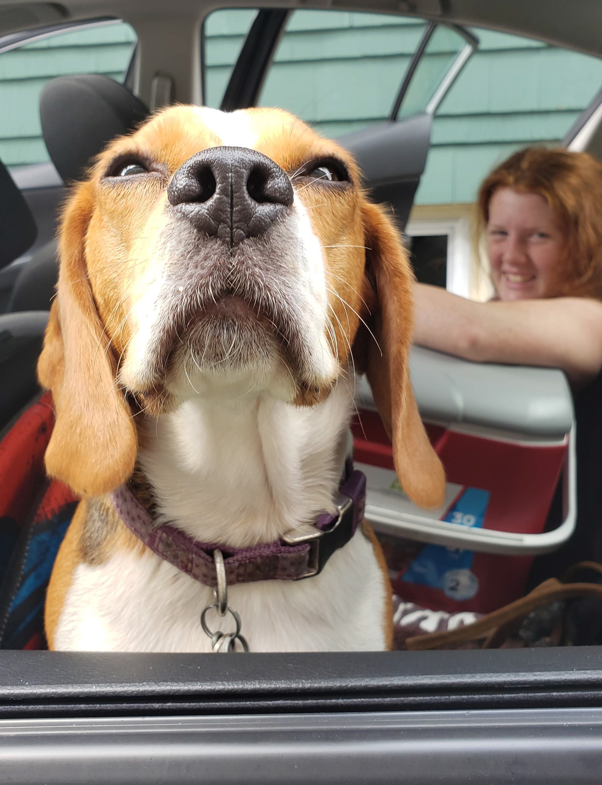

```{r setup, include=FALSE}
knitr::opts_chunk$set(echo = FALSE)
if (!"palmerpenguins" %in% installed.packages()) {
  remotes::install_github("allisonhorst/palmerpenguins")
}
library(palmerpenguins)
library(ggplot2)
```

## Introduction

- Birthday: March 14, 1998

<br>

- Where I grew up: Templeton, MA

<br>

- Program I'm currently in: Statistics MS

<br>

- Expected graduation date: May 2022


## Favorite Animal

<center>
{width=40%}
</center>
- This is Pepper, my sister's beagle. Beagles are my favorite breed of dogs. Don't mind my sister photobombing in the background!

## Favorite Plot

```{r plot, echo = FALSE, warning=FALSE}
ggplot(penguins, aes(x = body_mass_g, y = bill_length_mm)) + geom_point(color="yellow", size=4) + theme(panel.background = element_rect(fill="salmon"), panel.grid.major = element_line(colour = "blue", size=1.5), panel.grid.minor = element_line(colour = "green")) + ggtitle("Penguin Body Mass vs Bill Length") + xlab("Body Mass (g)") + ylab("Bill Length (mm)") 
```

## Link to my CV


